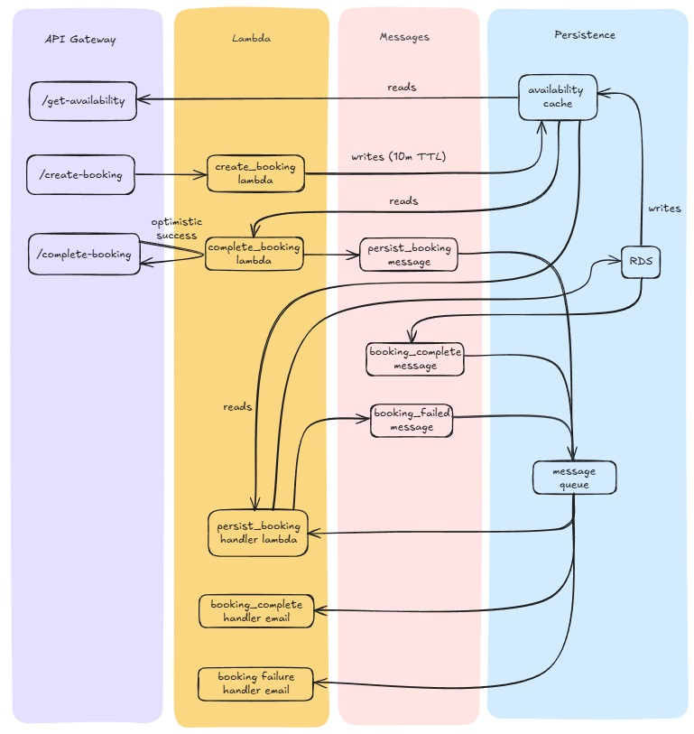

# Cinema Booking System

A modern, serverless cinema booking system built with a microservices architecture that enables real-time seat availability checking and booking management.

## System Architecture

The system is built using a serverless architecture with the following components:

### API Gateway
- `/get-availability` - Check seat availability
- `/create-booking` - Create new booking
- `/complete-booking` - Finalize booking process

### Lambda Functions
- `create_booking` - Handles initial booking creation
- `complete_booking` - Processes booking completion
- `persist_booking_handler` - Manages booking persistence
- `booking_complete_handler` - Handles successful bookings
- `booking_failure_handler` - Manages failed bookings

### Persistence Layer
- **RDS** - Primary database for booking records
- **Availability Cache** - Quick access cache with 10m TTL for seat availability
- **Message Queue** - Handles asynchronous processing of booking events

### Message Types
- `persist_booking_message`
- `booking_complete_message`
- `booking_failed_message`

## Key Features

- Real-time seat availability checking
- Optimistic concurrency for booking creation
- Fault-tolerant booking process
- Asynchronous booking confirmation
- Email notifications for booking status
- Cached availability data with TTL

## System Flow

1. Users can check seat availability through the `/get-availability` endpoint
2. Bookings are created via `/create-booking` with optimistic success
3. Booking completion is handled through `/complete-booking`
4. System maintains consistency through message queues and handlers
5. Users receive email confirmations for successful/failed bookings

## Technical Stack

- Serverless Architecture (AWS Lambda)
- API Gateway for RESTful endpoints
- RDS for persistent storage
- Message queuing for asynchronous processing
- Caching layer for performance optimization

## Getting Started

`npm i`

## Development

`npm run dev`